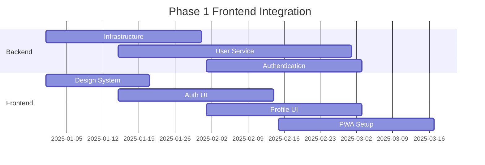
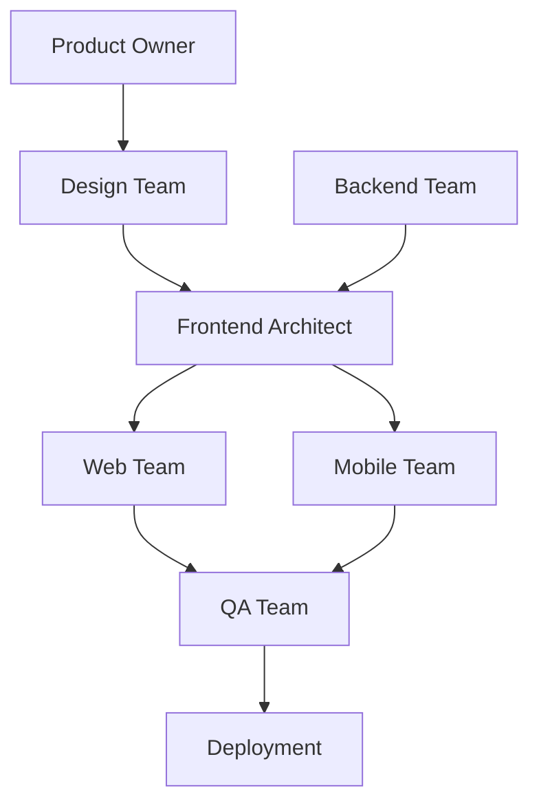

# SyriaMart Frontend Implementation Plan

**Document Type**: Frontend Implementation Strategy  
**Last Updated**: January 16, 2025  
**Version**: 1.0.0  
**Status**: DRAFT - Pending Integration with Master Plan  
**Critical Gap**: Addressing missing UI/UX development in current implementation plan

---

## Table of Contents

1. [Executive Summary](#executive-summary)
2. [Gap Analysis](#gap-analysis)
3. [Technology Stack](#technology-stack)
4. [Architecture Overview](#architecture-overview)
5. [Phase Integration](#phase-integration)
6. [Deliverables by Phase](#deliverables-by-phase)
7. [Quality Standards](#quality-standards)
8. [Team Structure](#team-structure)
9. [Syrian Market Requirements](#syrian-market-requirements)
10. [Testing Strategy](#testing-strategy)
11. [Performance Requirements](#performance-requirements)
12. [Accessibility Standards](#accessibility-standards)
13. [Risk Mitigation](#risk-mitigation)

---

## Executive Summary

The current SyriaMart implementation plan lacks comprehensive frontend development strategy, despite 60%+ of users accessing via mobile devices. This document provides a complete frontend implementation plan that integrates with existing backend phases while addressing Syrian market-specific requirements including Arabic RTL support, offline capabilities, and mobile-first design.

### Critical Success Factors
- **Mobile-first architecture** supporting slow 3G connections
- **Offline browsing** capability via Progressive Web App
- **Native Arabic RTL** support, not just translations
- **Sub-3-second load times** on Syrian infrastructure
- **Component reusability** between web and mobile platforms

---

## Gap Analysis

### Current Plan Deficiencies
1. **No UI/UX design phase** defined
2. **No frontend technology stack** specified
3. **No mobile app development** timeline
4. **No Arabic RTL testing** procedures
5. **No frontend performance metrics**
6. **No accessibility standards** defined
7. **No visual regression testing**
8. **No offline capability planning**

### Business Impact
- **User Acquisition**: Cannot onboard users without interfaces
- **Revenue Loss**: No purchase flow means zero revenue
- **Market Fit**: Ignoring mobile-first requirement for Syrian market
- **Competition**: Delayed time-to-market without parallel frontend development

---

## Technology Stack

### Web Application
```yaml
Framework: Next.js 14
  - React 18 for component architecture
  - Server-side rendering for SEO
  - API routes for BFF pattern
  - Built-in performance optimizations
  - Excellent i18n support

Styling: Tailwind CSS v3
  - RTL utilities out-of-box
  - Mobile-first approach
  - Minimal bundle size
  - Design token support
  - Dark mode ready

State Management:
  - Zustand: Lightweight global state
  - React Query v5: Server state management
  - Context API: Theme and locale

PWA Stack:
  - Workbox: Service worker management
  - IndexedDB: Offline data storage
  - Web Push API: Notifications
```

### Mobile Application
```yaml
Framework: React Native 0.73
  - Code sharing with web
  - Native performance
  - Hot reload development
  - Large ecosystem

Navigation: React Navigation v6
  - Type-safe routing
  - Deep linking support
  - Native transitions

State & Storage:
  - Same as web (Zustand + React Query)
  - AsyncStorage: Persistent storage
  - SQLite: Offline database

Native Features:
  - Camera: Product photos
  - Biometrics: Secure authentication
  - Push notifications: Orders/offers
  - Background sync: Offline orders
```

### Shared Packages
```yaml
Monorepo: Turborepo
  - Shared component library
  - Common utilities
  - API client
  - Type definitions
  - Design tokens

Testing: 
  - Jest: Unit testing
  - Testing Library: Component testing
  - Cypress: E2E web
  - Detox: E2E mobile
  - Percy: Visual regression
```

---

## Architecture Overview

### Frontend Architecture Principles
1. **Component-Driven Development**: Reusable UI components
2. **Design System First**: Consistent experience across platforms
3. **API-First Integration**: Types generated from OpenAPI specs
4. **Progressive Enhancement**: Core functionality works everywhere
5. **Performance Budget**: Enforced limits on bundle sizes

### Directory Structure
```
frontend/
├── apps/
│   ├── web/                    # Next.js web application
│   │   ├── pages/             # Route pages
│   │   ├── components/        # Web-specific components
│   │   ├── styles/           # Global styles
│   │   └── public/           # Static assets
│   │
│   └── mobile/                # React Native app
│       ├── src/
│       │   ├── screens/      # App screens
│       │   ├── navigation/   # Navigation config
│       │   └── components/   # Mobile-specific
│       └── ios/android/      # Native code
│
├── packages/
│   ├── ui/                   # Shared component library
│   │   ├── components/       # Cross-platform components
│   │   ├── tokens/          # Design tokens
│   │   └── utils/           # UI utilities
│   │
│   ├── api-client/          # Generated from OpenAPI
│   ├── store/               # Shared state management
│   ├── i18n/                # Translations
│   └── types/               # Shared TypeScript types
│
├── tools/
│   ├── eslint-config/       # Shared ESLint rules
│   ├── tsconfig/            # Shared TS config
│   └── build/               # Build scripts
│
└── docs/
    ├── design-system/       # Component documentation
    ├── architecture/        # Frontend architecture
    └── style-guide/         # Coding standards
```

---

## Phase Integration

### Revised Phase Timeline with Frontend

#### Phase 1: Foundation Platform + Core UI (Months 1-3)
**Backend Focus**: Infrastructure, User Service, Authentication  
**Frontend Focus**: Authentication UI, Profile Management, PWA Setup

**Parallel Development Tracks:**


#### Phase 2: Marketplace Core + Commerce UI (Months 4-6)
**Backend Focus**: Vendor Service, Catalog, Orders, Payments  
**Frontend Focus**: Product Discovery, Shopping Cart, Checkout, Vendor Dashboard

#### Phase 3: Advanced Commerce + Enhanced UX (Months 7-9)
**Backend Focus**: ML/AI, Multi-warehouse, Reviews  
**Frontend Focus**: Personalization UI, Social Features, B2B Interfaces

#### Phase 4: Scale & Optimize + Performance (Months 10-12)
**Backend Focus**: Performance, Security, Monitoring  
**Frontend Focus**: Performance Optimization, A11y Improvements, Analytics Dashboards

#### Phase 5: Innovation + Future UI (Months 13-15)
**Backend Focus**: Voice, AR, Crypto, Expansion  
**Frontend Focus**: Voice UI, AR Integration, Advanced Payment UIs

---

## Deliverables by Phase

### Phase 1 Frontend Deliverables

#### Design Deliverables
| Deliverable | Location | Format | Review Required |
|-------------|----------|--------|-----------------|
| Design System | `design/figma/design-system.fig` | Figma | Design Lead + Arabic UX |
| Component Library | `frontend/packages/ui/` | React/RN | Frontend Architect |
| Style Guide | `docs/style-guide.md` | Markdown | Team Lead |
| Arabic Typography | `design/typography-ar.pdf` | PDF | Arabic Speaker |
| Mobile Wireframes | `design/mobile-wireframes.fig` | Figma | Product Owner |

#### Development Deliverables
| Component | Web Location | Mobile Location | Status Tracking |
|-----------|--------------|-----------------|-----------------|
| Login/Register | `web/pages/auth/` | `mobile/src/screens/Auth/` | Storybook |
| User Profile | `web/pages/profile/` | `mobile/src/screens/Profile/` | Storybook |
| Address Book | `web/components/AddressBook/` | `mobile/src/components/AddressBook/` | Jest Coverage |
| PWA Shell | `web/public/sw.js` | N/A | Lighthouse |
| Offline Pages | `web/pages/_offline.tsx` | `mobile/src/screens/Offline/` | Manual Test |

#### Testing Deliverables
| Test Type | Tool | Location | Success Criteria |
|-----------|------|----------|------------------|
| Unit Tests | Jest | `*/__tests__/` | >85% coverage |
| Visual Tests | Percy | `.percy/` | No regressions |
| A11y Tests | axe-core | `cypress/a11y/` | WCAG 2.1 AA |
| Performance | Lighthouse | `reports/lighthouse/` | Score >90 |
| RTL Tests | Manual + Auto | `tests/rtl/` | 100% screens |

### Phase 2 Frontend Deliverables

#### Product Discovery UI
- Product listing pages with filters
- Product detail pages with gallery
- Search interface with auto-complete
- Category navigation
- Quick view modals

#### Shopping Experience
- Shopping cart with persistence
- Multi-step checkout flow
- Payment method selection UI
- Order confirmation screens
- Order tracking dashboard

#### Vendor Interfaces
- Vendor onboarding flow
- Product management CRUD
- Order management dashboard
- Analytics and reports
- Commission tracking

### Phase 3-5 Deliverables
[Detailed deliverables for each phase following similar structure]

---

## Quality Standards

### Mandatory Frontend Standards

#### Code Quality
```yaml
ESLint Rules:
  - Airbnb config base
  - React hooks rules
  - Accessibility plugin
  - RTL specific rules

TypeScript:
  - Strict mode enabled
  - No implicit any
  - No unused variables
  - Proper typing for all props

Component Standards:
  - Props documentation required
  - Storybook story required
  - Unit test required
  - Accessibility test required
  - RTL variant required
```

#### Performance Budget
```yaml
Web Performance:
  - First Contentful Paint: <1.5s
  - Time to Interactive: <3.0s
  - Cumulative Layout Shift: <0.1
  - JavaScript Bundle: <200KB initial
  - CSS Bundle: <50KB initial

Mobile Performance:
  - App size: <50MB (Android), <100MB (iOS)
  - Cold start: <3s
  - Memory usage: <200MB
  - Battery efficient
  - Offline capable
```

#### Accessibility Requirements
```yaml
WCAG 2.1 Level AA:
  - Color contrast 4.5:1 minimum
  - Keyboard navigation complete
  - Screen reader compatible
  - Focus indicators visible
  - Error messages clear

Additional Requirements:
  - RTL reading order correct
  - Touch targets 44x44px minimum
  - Reduced motion support
  - High contrast mode
  - Text scalable to 200%
```

---

## Team Structure

### Frontend Team Composition

#### Core Team
| Role | Count | Responsibilities | Required Skills |
|------|-------|------------------|-----------------|
| Frontend Architect | 1 | Architecture, standards, reviews | React, RN, Arabic apps |
| UI/UX Designer | 2 | Designs, prototypes, user testing | Figma, Arabic design |
| Web Engineers | 3 | Next.js development | React, TypeScript, PWA |
| Mobile Engineers | 3 | React Native development | iOS, Android, React Native |
| QA Engineers | 2 | Testing, automation | Cypress, Detox, Jest |

#### Specialized Roles
| Role | Count | Responsibilities |
|------|-------|------------------|
| Arabic UX Specialist | 1 | RTL design, typography, cultural adaptation |
| Performance Engineer | 1 | Optimization, monitoring, budgets |
| Accessibility Specialist | 1 | WCAG compliance, assistive tech testing |

### Collaboration Model


---

## Syrian Market Requirements

### Critical Adaptations

#### Arabic Language Support
```typescript
// RTL Configuration Example
export const rtlConfig = {
  // Typography
  fontFamily: {
    arabic: ['Noto Naskh Arabic', 'Arial'],
    latin: ['Inter', 'Arial']
  },
  
  // Direction-aware spacing
  spacing: {
    marginStart: 'margin-inline-start',
    marginEnd: 'margin-inline-end',
    paddingStart: 'padding-inline-start',
    paddingEnd: 'padding-inline-end'
  },
  
  // Logical properties
  textAlign: {
    start: 'start',
    end: 'end'
  }
};
```

#### Offline Capabilities
```typescript
// Service Worker Strategy
export const offlineStrategy = {
  // Cache critical paths
  precache: [
    '/',
    '/products',
    '/cart',
    '/profile'
  ],
  
  // Runtime caching
  runtimeCaching: [
    {
      urlPattern: /^https:\/\/api\.syriamart\.com\/products/,
      handler: 'StaleWhileRevalidate',
      options: {
        cacheName: 'products-cache',
        expiration: {
          maxEntries: 100,
          maxAgeSeconds: 7 * 24 * 60 * 60 // 1 week
        }
      }
    }
  ],
  
  // Offline fallback
  offlinePage: '/offline'
};
```

#### Mobile Optimization
```yaml
Image Optimization:
  - WebP with JPEG fallback
  - Responsive images (srcset)
  - Lazy loading below fold
  - Progressive enhancement
  - CDN delivery

Network Optimization:
  - Request batching
  - GraphQL for mobile
  - Delta sync for data
  - Compressed payloads
  - Connection detection
```

#### Payment UI Adaptations
- Cash on Delivery prominence
- Mobile wallet integrations (Syriatel, MTN)
- Clear payment security indicators
- Order tracking without login
- SMS order confirmations

---

## Testing Strategy

### Frontend-Specific Testing

#### Testing Pyramid
```
         E2E Tests (10%)
        /            \
    Integration (30%)
   /                \
Unit Tests (60%)
```

#### Test Categories

##### Unit Tests
```typescript
// Component Test Example
describe('ProductCard', () => {
  it('renders product information correctly', () => {
    const product = mockProduct();
    render(<ProductCard product={product} />);
    
    expect(screen.getByText(product.name)).toBeInTheDocument();
    expect(screen.getByText(formatPrice(product.price))).toBeInTheDocument();
  });
  
  it('handles RTL layout correctly', () => {
    const { container } = render(
      <ThemeProvider theme="rtl">
        <ProductCard product={mockProduct()} />
      </ThemeProvider>
    );
    
    expect(container.firstChild).toHaveStyle('direction: rtl');
  });
});
```

##### Visual Regression Tests
```yaml
Percy Configuration:
  - Breakpoints: [375, 768, 1280]
  - CSS animation: disabled
  - JavaScript: enabled
  - Locales: [en, ar]
  - Themes: [light, dark]
```

##### Accessibility Tests
```typescript
// Automated A11y Test
describe('Accessibility', () => {
  it('has no accessibility violations', async () => {
    const { container } = render(<HomePage />);
    const results = await axe(container);
    
    expect(results).toHaveNoViolations();
  });
});
```

##### Performance Tests
```javascript
// Lighthouse CI Config
module.exports = {
  ci: {
    assert: {
      assertions: {
        'categories:performance': ['error', { minScore: 0.9 }],
        'categories:accessibility': ['error', { minScore: 0.9 }],
        'first-contentful-paint': ['error', { maxNumericValue: 1500 }],
        'interactive': ['error', { maxNumericValue: 3000 }],
        'max-potential-fid': ['error', { maxNumericValue: 100 }]
      }
    }
  }
};
```

### Mobile App Testing

#### Device Matrix
| Platform | Versions | Devices | Priority |
|----------|----------|---------|----------|
| iOS | 14+ | iPhone 8+, iPad | High |
| Android | 8+ | Samsung, Xiaomi, Huawei | High |

#### Test Scenarios
1. **Network Conditions**: 2G, 3G, 4G, Offline
2. **Device States**: Low battery, limited storage
3. **Interruptions**: Calls, notifications
4. **Orientations**: Portrait, landscape
5. **Languages**: Arabic RTL, English LTR

---

## Performance Requirements

### Web Performance Metrics

#### Core Web Vitals
| Metric | Target | Mobile Target | Measurement |
|--------|--------|---------------|-------------|
| LCP | <2.5s | <3.0s | Largest content paint |
| FID | <100ms | <150ms | First input delay |
| CLS | <0.1 | <0.15 | Layout shift |
| TTFB | <600ms | <800ms | Backend response |

#### Custom Metrics
| Metric | Target | Rationale |
|--------|--------|-----------|
| Product List Load | <1s | Critical user path |
| Add to Cart | <300ms | Perceived performance |
| Search Results | <500ms | User retention |
| Image Load | <2s | Visual completeness |

### Mobile Performance

#### App Performance Targets
```yaml
Launch Performance:
  - Cold start: <3s
  - Warm start: <1.5s
  - Hot start: <500ms

Runtime Performance:
  - Frame rate: 60fps
  - Memory: <200MB
  - Battery: <5% per hour active use
  - Network: Minimal data usage

Offline Performance:
  - Browse products: Full speed
  - Add to cart: Instant
  - Sync time: <10s on reconnect
```

### Performance Monitoring

#### Real User Monitoring (RUM)
```typescript
// Performance tracking
export const performanceMetrics = {
  // Navigation timing
  trackPageLoad: () => {
    const navigation = performance.getEntriesByType('navigation')[0];
    analytics.track('Page Load', {
      ttfb: navigation.responseStart - navigation.requestStart,
      domLoad: navigation.domContentLoadedEventEnd - navigation.domContentLoadedEventStart,
      windowLoad: navigation.loadEventEnd - navigation.loadEventStart
    });
  },
  
  // User timing
  trackUserAction: (action: string, duration: number) => {
    performance.measure(action);
    analytics.track('User Action', { action, duration });
  }
};
```

---

## Accessibility Standards

### WCAG 2.1 Level AA Compliance

#### Implementation Checklist
- [ ] All images have appropriate alt text
- [ ] Form inputs have associated labels
- [ ] Error messages are programmatically associated
- [ ] Color is not sole conveyor of information
- [ ] Keyboard navigation works throughout
- [ ] Skip links provided for navigation
- [ ] Focus indicators clearly visible
- [ ] Headings follow logical hierarchy
- [ ] ARIA landmarks properly used
- [ ] Live regions for dynamic content

#### Arabic-Specific Accessibility
```css
/* RTL-aware focus indicators */
.button:focus {
  outline: 3px solid var(--focus-color);
  outline-offset: 2px;
}

/* Logical properties for RTL */
.card {
  margin-inline-start: 1rem;
  padding-inline-end: 1rem;
  border-start-start-radius: 8px;
}
```

#### Testing Tools
1. **Automated**: axe-core, WAVE, Lighthouse
2. **Manual**: Keyboard testing, screen readers
3. **User Testing**: Users with disabilities
4. **Compliance**: Regular audits

---

## Risk Mitigation

### Frontend-Specific Risks

#### Technical Risks
| Risk | Impact | Mitigation | Contingency |
|------|--------|------------|-------------|
| RTL bugs | High | Continuous testing, Arabic QA | Manual fixes |
| Performance issues | High | Performance budget, monitoring | Code splitting |
| Browser compatibility | Medium | Progressive enhancement | Polyfills |
| Offline sync conflicts | Medium | Conflict resolution strategy | Manual resolution |

#### Resource Risks
| Risk | Impact | Mitigation | Contingency |
|------|--------|------------|-------------|
| Arabic designer availability | High | Early hiring, remote options | Design agency |
| Frontend expertise | Medium | Training, documentation | Consultants |
| Device testing | Medium | Device lab, cloud testing | Beta program |

#### Market Risks
| Risk | Impact | Mitigation | Contingency |
|------|--------|------------|-------------|
| Slow adoption | High | User testing, feedback loops | Feature adjustments |
| Competition features | Medium | Rapid iteration, monitoring | Quick releases |
| Technology changes | Low | Standard tech, abstractions | Migration plan |

### Risk Monitoring Dashboard
- Weekly risk review meetings
- Automated performance alerts
- User feedback tracking
- Competitor analysis
- Technology radar updates

---

## Integration Points

### Backend Integration

#### API Client Generation
```bash
# Generate TypeScript client from OpenAPI
npm run generate:api-client

# Output structure
api-client/
  ├── models/      # TypeScript interfaces
  ├── services/    # API methods
  ├── http/        # HTTP client wrapper
  └── index.ts     # Public exports
```

#### State Synchronization
```typescript
// React Query + Backend Integration
export const useProducts = (filters: ProductFilters) => {
  return useQuery({
    queryKey: ['products', filters],
    queryFn: () => api.products.list(filters),
    staleTime: 5 * 60 * 1000, // 5 minutes
    cacheTime: 10 * 60 * 1000, // 10 minutes
    retry: 3,
    retryDelay: attemptIndex => Math.min(1000 * 2 ** attemptIndex, 30000)
  });
};
```

#### Error Handling
```typescript
// Consistent error handling
export const handleApiError = (error: ApiError): UserMessage => {
  // Arabic error messages
  const messages = {
    ar: {
      network: 'خطأ في الاتصال. يرجى المحاولة مرة أخرى',
      auth: 'يرجى تسجيل الدخول للمتابعة',
      validation: 'يرجى التحقق من البيانات المدخلة',
      server: 'عذراً، حدث خطأ. يرجى المحاولة لاحقاً'
    },
    en: {
      network: 'Connection error. Please try again',
      auth: 'Please login to continue',
      validation: 'Please check your input',
      server: 'Sorry, an error occurred. Please try later'
    }
  };
  
  return messages[locale][error.type] || messages[locale].server;
};
```

---

## Deployment Strategy

### Frontend Deployment Pipeline

#### Web Application
```yaml
deployment:
  staging:
    - Build Next.js application
    - Run tests (unit, integration, e2e)
    - Check bundle sizes
    - Deploy to Vercel/Netlify
    - Run Lighthouse CI
    - Visual regression tests
    
  production:
    - All staging checks
    - Performance testing
    - Security scanning
    - CDN cache warming
    - Progressive rollout (10%, 50%, 100%)
    - Monitoring alerts
```

#### Mobile Application
```yaml
deployment:
  ios:
    - Build IPA
    - Run Detox tests
    - Submit to TestFlight
    - Beta testing (100 users)
    - App Store submission
    - Phased rollout
    
  android:
    - Build APK/AAB
    - Run Detox tests
    - Upload to Play Console
    - Internal testing track
    - Production rollout
    - Staged rollout (5%, 25%, 50%, 100%)
```

### Rollback Procedures
```bash
# Web rollback (< 1 minute)
vercel rollback syriamart-web --to=previous

# Mobile rollback
# iOS: Expedited review + new version
# Android: Halt rollout + previous APK
```

---

## Success Metrics

### User Experience Metrics
| Metric | Target | Measurement Method |
|--------|--------|-------------------|
| Page Load Time | <3s on 3G | RUM |
| Task Completion | >90% | Analytics |
| Error Rate | <1% | Error tracking |
| Bounce Rate | <30% | Analytics |
| Mobile Usage | >60% | Analytics |

### Business Metrics
| Metric | Phase 1 | Phase 2 | Phase 3 |
|--------|---------|---------|---------|
| Mobile Downloads | 10K | 50K | 200K |
| Daily Active Users | 1K | 10K | 50K |
| Conversion Rate | 1% | 2% | 3% |
| Cart Abandonment | <70% | <60% | <50% |

### Technical Metrics
| Metric | Target | Tool |
|--------|--------|------|
| Lighthouse Score | >90 | Lighthouse CI |
| Test Coverage | >85% | Jest |
| Build Time | <5 min | CI/CD |
| Deploy Time | <10 min | Vercel/Netlify |

---

## Conclusion

This Frontend Implementation Plan addresses the critical gap in the current SyriaMart development strategy. By implementing this plan in parallel with backend development, we ensure:

1. **No delayed launch** due to missing frontend
2. **True mobile-first** experience for Syrian users  
3. **Offline capabilities** from day one
4. **World-class Arabic** user experience
5. **Measurable performance** meeting user expectations

The frontend is not an afterthought but an equal partner in delivering a successful e-commerce platform for the Syrian market.

---

**Document Status**: This plan requires integration with the Master Implementation Plan and approval from project stakeholders before execution.

**Next Steps**:
1. Review and approve this plan
2. Update Master Implementation Plan
3. Hire Arabic UX specialist
4. Begin Phase 1 design work
5. Set up frontend infrastructure