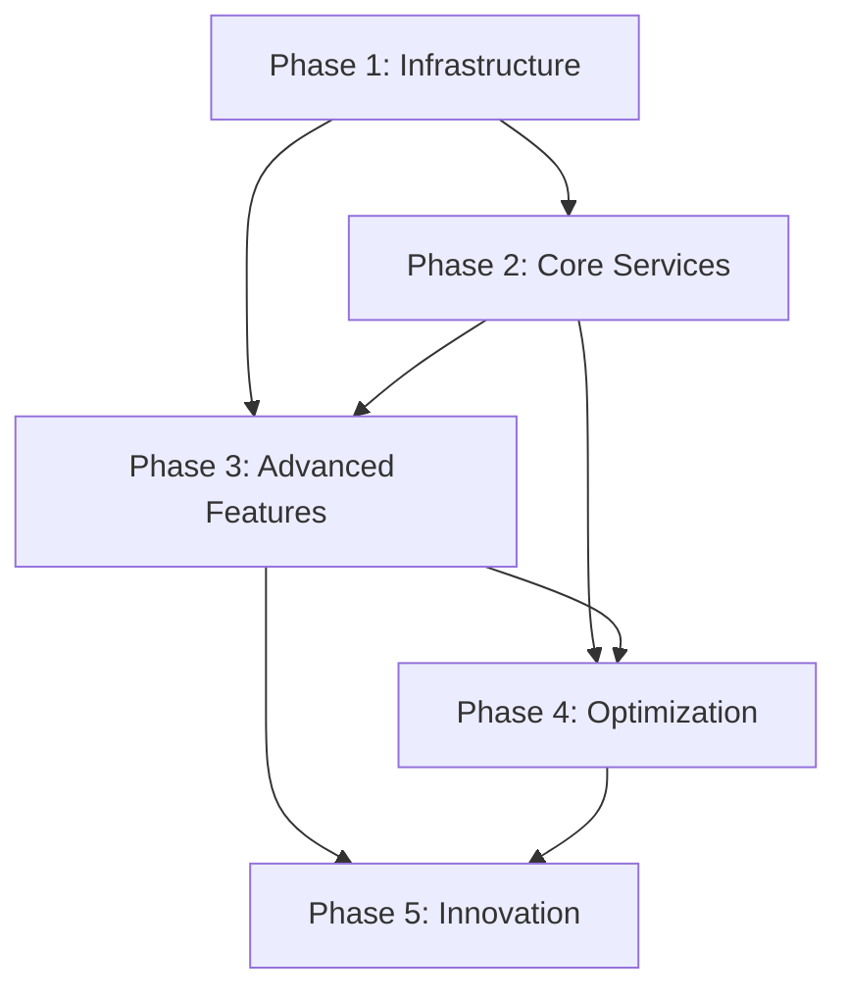

# SyriaMart Master Implementation Plan

**Document Type**: Master Implementation Plan (Single Source of Truth)  
**Last Updated**: January 16, 2025  
**Version**: 2.0.0  
**Status**: ACTIVE - Phase 1 In Progress  
**Project Timeline**: January 2025 - March 2026 (15 months)  
**Major Update**: Integrated comprehensive frontend development strategy

---

## Table of Contents

1. [Executive Summary](#executive-summary)
2. [Project Overview](#project-overview)
3. [Phase Timeline](#phase-timeline)
4. [Phase 1: Foundation Platform](#phase-1-foundation-platform)
5. [Phase 2: Marketplace Core](#phase-2-marketplace-core)
6. [Phase 3: Advanced Commerce](#phase-3-advanced-commerce)
7. [Phase 4: Scale & Optimize](#phase-4-scale--optimize)
8. [Phase 5: Innovation & Expansion](#phase-5-innovation--expansion)
9. [Cross-Phase Dependencies](#cross-phase-dependencies)
10. [Risk Management](#risk-management)
11. [Progress Tracking](#progress-tracking)
12. [Update Protocol](#update-protocol)

---

## Executive Summary

This Master Implementation Plan serves as the **single source of truth** for the SyriaMart e-commerce platform development. It documents all phases, deliverables, quality gates, dependencies, and progress tracking mechanisms.

### Key Principles
- **No feature deployment without meeting ALL quality gates**
- **Documentation-first development approach**
- **100% compliance with mandatory standards**
- **Continuous progress tracking and reporting**

### Current Status
- **Active Phase**: Phase 1 (Foundation Platform)
- **Progress**: Month 1 of 3
- **Overall Project Completion**: 6%

---

## Project Overview

### Vision
Build a world-class e-commerce platform tailored for the Syrian market, addressing unique challenges including connectivity issues, payment limitations, and language requirements.

### Core Requirements
- Mobile-first architecture (60%+ users on mobile)
- Offline capabilities for intermittent connectivity
- Arabic (RTL) as primary language
- Local payment method integration
- Support for cash-on-delivery

### Technology Stack

#### Backend Stack
| Component | Technology | Justification |
|-----------|------------|---------------|
| Runtime | Node.js + TypeScript | Type safety, ecosystem |
| Databases | PostgreSQL, MongoDB | ACID + flexibility |
| Cache | Redis Cluster | Performance, sessions |
| Message Queue | Kafka/RabbitMQ | Event-driven architecture |
| Container | Docker + Kubernetes | Scalability, orchestration |
| Monitoring | Prometheus + Grafana | Comprehensive metrics |

#### Frontend Stack
| Component | Technology | Justification |
|-----------|------------|---------------|
| Web Framework | Next.js 14 + React 18 | SSR, SEO, performance, PWA |
| Mobile Framework | React Native 0.73 | Code sharing, native feel |
| UI Styling | Tailwind CSS | RTL support, mobile-first |
| State Management | Zustand + React Query | Lightweight, server state |
| Testing | Jest, Cypress, Percy | Unit, E2E, Visual regression |
| Component Docs | Storybook | Interactive documentation |
| CDN | CloudFlare | Global edge, Arab region |

---

## Phase Timeline

| Phase | Duration | Start Date | End Date | Status | Completion |
|-------|----------|------------|----------|---------|------------|
| **Phase 1** | 3 months | Jan 2025 | Mar 2025 | 🟢 Active | 20% |
| **Phase 2** | 3 months | Apr 2025 | Jun 2025 | 🔵 Planned | 0% |
| **Phase 3** | 3 months | Jul 2025 | Sep 2025 | 🔵 Planned | 0% |
| **Phase 4** | 3 months | Oct 2025 | Dec 2025 | 🔵 Planned | 0% |
| **Phase 5** | 3 months | Jan 2026 | Mar 2026 | 🔵 Planned | 0% |

---

## Phase 1: Foundation Platform & Core UI

### Overview
**Duration**: January 2025 - March 2025  
**Status**: 🟢 ACTIVE  
**Progress**: 20% Complete  
**Team Size**: 20 total (12 backend + 8 frontend/mobile)

### Objectives
1. Establish core infrastructure and DevOps pipeline
2. Implement user management and authentication system
3. Set up monitoring and logging infrastructure
4. Create foundation for all future services

### Month-by-Month Breakdown

#### Month 1 (January 2025) - Infrastructure Setup
**Status**: 🟡 In Progress (60% Complete)

##### Week 1-2: Development Environment
| Task | Status | Owner | Deadline | Dependencies |
|------|---------|-------|----------|--------------|
| Git repository setup | ✅ Complete | DevOps | Jan 7 | None |
| CI/CD pipeline configuration | ✅ Complete | DevOps | Jan 10 | Git setup |
| Docker environment setup | 🔄 In Progress | DevOps | Jan 14 | None |
| Local Kubernetes cluster | 📅 Planned | DevOps | Jan 14 | Docker |
| Development documentation | ✅ Complete | Tech Lead | Jan 12 | All above |

##### Week 1-2: Frontend Setup (Parallel Track)
| Task | Status | Owner | Deadline | Dependencies |
|------|---------|-------|----------|--------------|
| Design system planning | 🔄 In Progress | UI/UX Lead | Jan 10 | None |
| Figma workspace setup | ✅ Complete | Design | Jan 7 | None |
| Frontend monorepo setup | 🔄 In Progress | Frontend Lead | Jan 12 | Git setup |
| Component library init | 📅 Planned | Frontend | Jan 14 | Monorepo |
| Arabic typography research | 📅 Planned | Arabic UX | Jan 14 | Design system |

##### Week 3-4: Core Infrastructure
| Task | Status | Owner | Deadline | Dependencies |
|------|---------|-------|----------|--------------|
| Production K8s cluster | 📅 Planned | Infrastructure | Jan 21 | Cloud account |
| PostgreSQL cluster setup | 📅 Planned | Database | Jan 24 | K8s cluster |
| Redis cluster configuration | 📅 Planned | Infrastructure | Jan 26 | K8s cluster |
| Kafka/RabbitMQ setup | 📅 Planned | Infrastructure | Jan 28 | K8s cluster |
| Monitoring stack | 📅 Planned | SRE | Jan 31 | All above |

##### Week 3-4: Frontend Foundation (Parallel Track)
| Task | Status | Owner | Deadline | Dependencies |
|------|---------|-------|----------|--------------|
| Next.js app setup | 📅 Planned | Frontend | Jan 21 | Monorepo |
| React Native app init | 📅 Planned | Mobile | Jan 21 | Monorepo |
| Tailwind + RTL config | 📅 Planned | Frontend | Jan 24 | Apps setup |
| Storybook setup | 📅 Planned | Frontend | Jan 26 | Component lib |
| PWA configuration | 📅 Planned | Frontend | Jan 28 | Next.js app |
| CI/CD for frontend | 📅 Planned | DevOps | Jan 31 | Apps setup |

#### Month 2 (February 2025) - User Service Implementation
**Status**: 📅 Planned

##### Week 5-6: User Service Core
| Task | Status | Owner | Deadline | Dependencies |
|------|---------|-------|----------|--------------|
| Database schema design | 📅 Planned | Backend | Feb 7 | PostgreSQL |
| User CRUD operations | 📅 Planned | Backend | Feb 10 | Schema |
| Profile management | 📅 Planned | Backend | Feb 12 | CRUD |
| Address management | 📅 Planned | Backend | Feb 14 | CRUD |
| OpenAPI documentation | 📅 Planned | Backend | Feb 14 | All above |

##### Week 5-6: Authentication UI (Parallel Track)
| Task | Status | Owner | Deadline | Dependencies |
|------|---------|-------|----------|--------------|
| Login/Register UI design | 📅 Planned | Design | Feb 7 | Design system |
| Auth components (Web) | 📅 Planned | Frontend | Feb 10 | UI design |
| Auth screens (Mobile) | 📅 Planned | Mobile | Feb 10 | UI design |
| Form validation + i18n | 📅 Planned | Frontend | Feb 12 | Auth components |
| Password strength meter | 📅 Planned | Frontend | Feb 14 | Auth components |
| Biometric auth (Mobile) | 📅 Planned | Mobile | Feb 14 | Auth screens |

##### Week 7-8: Authentication System
| Task | Status | Owner | Deadline | Dependencies |
|------|---------|-------|----------|--------------|
| JWT implementation | 📅 Planned | Security | Feb 21 | User service |
| OAuth2 integration | 📅 Planned | Backend | Feb 24 | JWT |
| Password reset flow | 📅 Planned | Backend | Feb 26 | Email service |
| Email verification | 📅 Planned | Backend | Feb 27 | Email service |
| Session management | 📅 Planned | Backend | Feb 28 | Redis |

##### Week 7-8: Profile & User Management UI (Parallel Track)
| Task | Status | Owner | Deadline | Dependencies |
|------|---------|-------|----------|--------------|
| Profile UI design | 📅 Planned | Design | Feb 21 | User data model |
| Profile components | 📅 Planned | Frontend | Feb 24 | UI design |
| Address book UI | 📅 Planned | Frontend | Feb 26 | Profile comp |
| Settings screens | 📅 Planned | Mobile | Feb 27 | Profile comp |
| API integration layer | 📅 Planned | Frontend | Feb 28 | OpenAPI spec |
| State management setup | 📅 Planned | Frontend | Feb 28 | API layer |

#### Month 3 (March 2025) - Security & Testing
**Status**: 📅 Planned

##### Week 9-10: Security Implementation
| Task | Status | Owner | Deadline | Dependencies |
|------|---------|-------|----------|--------------|
| API Gateway setup | 📅 Planned | Infrastructure | Mar 7 | K8s |
| Rate limiting | 📅 Planned | Security | Mar 10 | API Gateway |
| CORS configuration | 📅 Planned | Security | Mar 12 | API Gateway |
| Security headers | 📅 Planned | Security | Mar 13 | All services |
| Vault integration | 📅 Planned | Security | Mar 14 | Infrastructure |

##### Week 9-10: PWA & Performance (Parallel Track)
| Task | Status | Owner | Deadline | Dependencies |
|------|---------|-------|----------|--------------|
| Service worker impl | 📅 Planned | Frontend | Mar 7 | PWA config |
| Offline page design | 📅 Planned | Design | Mar 10 | PWA strategy |
| Push notifications | 📅 Planned | Frontend | Mar 12 | Service worker |
| App shell optimization | 📅 Planned | Frontend | Mar 13 | Performance |
| Image optimization | 📅 Planned | Frontend | Mar 14 | CDN setup |
| Bundle optimization | 📅 Planned | Frontend | Mar 14 | Build config |

##### Week 11-12: Testing & Documentation
| Task | Status | Owner | Deadline | Dependencies |
|------|---------|-------|----------|--------------|
| Unit tests (>85%) | 📅 Planned | QA | Mar 21 | All code |
| Integration tests | 📅 Planned | QA | Mar 24 | Services |
| Contract tests | 📅 Planned | QA | Mar 26 | API specs |
| Load testing | 📅 Planned | Performance | Mar 28 | Full stack |
| Final documentation | 📅 Planned | All teams | Mar 31 | Everything |

##### Week 11-12: Frontend Testing & Polish (Parallel Track)
| Task | Status | Owner | Deadline | Dependencies |
|------|---------|-------|----------|--------------|
| Visual regression setup | 📅 Planned | QA | Mar 21 | Percy account |
| E2E tests (Cypress) | 📅 Planned | QA | Mar 24 | All UI done |
| Mobile E2E (Detox) | 📅 Planned | QA | Mar 24 | Mobile app |
| A11y testing | 📅 Planned | QA | Mar 26 | WCAG audit |
| RTL screenshots | 📅 Planned | Arabic UX | Mar 28 | All screens |
| Performance audit | 📅 Planned | Frontend | Mar 31 | Lighthouse |

### Quality Gates - Phase 1

| Gate | Requirement | Status | Evidence |
|------|------------|---------|----------|
| API Documentation | 100% OpenAPI coverage | ✅ Met | `/docs/api-specs/` |
| Contract Testing | All endpoints + negative cases | ✅ Framework Ready | Pact configured |
| Security Scanning | Zero high/critical issues | ✅ Enforced | CI/CD gates |
| Code Coverage | Minimum 85% | 🔄 Tracking | Jest + Istanbul |
| Performance | 10K users, <200ms p95 | 📅 Pending | Load tests planned |
| Monitoring | Full observability stack | 📅 Pending | Prometheus/Grafana |
| Rollback | <5 minute execution | ✅ Documented | Procedures defined |
| Peer Review | 2+ engineer approval | ✅ Enforced | GitHub rules |
| **Frontend Gates** | | | |
| Lighthouse Score | >90 Performance | 📅 Pending | CI/CD integration |
| WCAG Compliance | Level AA | 📅 Pending | axe-core tests |
| RTL Testing | 100% screens | 📅 Pending | Visual tests |
| Mobile App Size | <50MB Android, <100MB iOS | 📅 Pending | Build analysis |
| Offline Mode | Core features work | 📅 Pending | PWA tests |

### Dependencies - Phase 1
- Cloud provider account setup
- Domain registration (syriamart.com)
- SSL certificates
- Email service provider
- SMS gateway for Syrian numbers

### Team Allocation - Phase 1
| Role | Count | Names/Assignments |
|------|-------|-------------------|
| **Backend Team** | | |
| Infrastructure | 3 | TBD |
| Backend Engineers | 4 | TBD |
| DevOps | 2 | TBD |
| QA (Backend) | 2 | TBD |
| Security | 1 | TBD |
| **Frontend Team** | | |
| UI/UX Designer | 2 | TBD (1 Arabic speaker required) |
| Frontend Engineers | 3 | TBD |
| Mobile Engineers | 2 | TBD |
| QA (Frontend) | 1 | TBD |
| Arabic UX Specialist | 1 | TBD |
| Frontend Architect | 1 | TBD |

### Deliverables - Phase 1
1. **Infrastructure**
   - Production-ready Kubernetes cluster
   - Complete CI/CD pipeline
   - Monitoring and alerting system
   - Disaster recovery procedures

2. **Backend Services**
   - User Management Service
   - Authentication Service
   - Email Service
   - Session Management

3. **Frontend Applications**
   - Next.js web application with PWA
   - React Native mobile app (iOS/Android)
   - Shared component library
   - Design system with Storybook
   - Arabic RTL implementation

4. **UI/UX Deliverables**
   - Complete design system in Figma
   - Authentication flow screens
   - User profile interfaces
   - Offline mode pages
   - Arabic typography guide

5. **Documentation**
   - Complete API documentation
   - Frontend architecture guide
   - Component documentation
   - Deployment runbooks
   - Security procedures
   - Developer onboarding guide

---

## Phase 2: Marketplace Core & Commerce UI

### Overview
**Duration**: April 2025 - June 2025  
**Status**: 🔵 PLANNED  
**Team Size**: 20 total (12 backend + 8 frontend/mobile)

### Objectives
1. Implement vendor management system
2. Create product catalog with advanced search
3. Build order management system
4. Integrate Syrian payment providers
5. Design and build product discovery UI
6. Implement shopping cart and checkout flow
7. Create vendor dashboard interfaces
8. Optimize for mobile commerce experience

### Month-by-Month Breakdown

#### Month 4 (April 2025) - Vendor & Catalog Services

##### Week 13-14: Vendor Service
| Task | Owner | Dependencies | Deliverable |
|------|-------|--------------|-------------|
| Vendor registration flow | Backend | User service | REST API |
| Store management | Backend | Vendor registration | Admin panel |
| Commission system | Backend | Payment service | Commission engine |
| Vendor dashboard API | Frontend | All vendor APIs | Dashboard |
| Document upload | Backend | Storage service | File management |

##### Week 15-16: Catalog Service
| Task | Owner | Dependencies | Deliverable |
|------|-------|--------------|-------------|
| Product CRUD | Backend | MongoDB | Product API |
| Category management | Backend | Product CRUD | Category tree |
| Inventory tracking | Backend | Product CRUD | Stock management |
| Image management | Backend | CDN setup | Image service |
| MongoDB optimization | Database | MongoDB cluster | Performance |

#### Month 5 (May 2025) - Order & Search Implementation

##### Week 17-18: Order Service
| Task | Owner | Dependencies | Deliverable |
|------|-------|--------------|-------------|
| Cart management | Backend | User service | Cart API |
| Order creation | Backend | Cart, Inventory | Order API |
| State machine | Backend | Temporal | Workflow engine |
| Order history | Backend | Order creation | History API |
| Temporal setup | Infrastructure | K8s | Workflow service |

##### Week 19-20: Search Service
| Task | Owner | Dependencies | Deliverable |
|------|-------|--------------|-------------|
| Elasticsearch setup | Infrastructure | K8s | Search cluster |
| Product indexing | Backend | Catalog service | Index pipeline |
| Search API | Backend | Elasticsearch | Search endpoints |
| Faceted search | Backend | Search API | Filter system |
| Arabic support | Backend | NLP libs | Arabic search |

#### Month 6 (June 2025) - Payment Integration

##### Week 21-22: Payment Service
| Task | Owner | Dependencies | Deliverable |
|------|-------|--------------|-------------|
| Payment abstraction | Backend | None | Payment interface |
| SEP integration | Backend | SEP account | SEP gateway |
| Syriatel Cash | Backend | Syriatel API | Mobile payment |
| MTN Pay | Backend | MTN API | Mobile payment |
| Transaction management | Backend | All gateways | Transaction API |

##### Week 23-24: Integration Testing
| Task | Owner | Dependencies | Deliverable |
|------|-------|--------------|-------------|
| E2E order flow | QA | All services | Test suite |
| Payment testing | QA | Test accounts | Payment tests |
| Performance optimization | Performance | Monitoring | Optimizations |
| Security audit | Security | All services | Audit report |
| Documentation | Tech writers | All above | Updated docs |

### Quality Gates - Phase 2

| Gate | Requirement | Target |
|------|------------|---------|
| Vendor Onboarding | <24 hour approval | Automated workflow |
| Search Performance | <100ms response time | Elasticsearch optimization |
| Payment Success Rate | >95% transaction success | Provider redundancy |
| Arabic Language | 100% RTL support | Native implementation |
| Mobile API | Optimized payloads | <50KB responses |
| Order Processing | <2 second confirmation | Async processing |

### Dependencies - Phase 2
- Payment provider accounts (SEP, Syriatel, MTN)
- Elasticsearch license
- MongoDB Atlas or self-hosted cluster
- Arabic NLP libraries
- Temporal workflow engine

### Deliverables - Phase 2
1. **Services**
   - Vendor Management Service
   - Product Catalog Service
   - Search Service
   - Order Management Service
   - Payment Service

2. **Integrations**
   - Syrian payment providers
   - SMS notifications
   - Email campaigns
   - Inventory sync

---

## Phase 3: Advanced Commerce

### Overview
**Duration**: July 2025 - September 2025  
**Status**: 🔵 PLANNED  
**Team Size**: 12 engineers

### Objectives
1. Implement AI-powered recommendations
2. Multi-warehouse inventory management
3. Reviews and ratings system
4. B2B marketplace features

### Key Deliverables

#### AI & Analytics Platform
- Recommendation engine with >85% accuracy
- User behavior tracking
- A/B testing framework
- Real-time analytics dashboard
- Personalization service

#### Multi-Warehouse System
- Distributed inventory management
- Smart routing algorithms
- Stock synchronization
- Transfer management
- Warehouse analytics

#### Review System
- User reviews and ratings
- Verified purchase badges
- Moderation workflow
- Review analytics
- Seller response system

#### B2B Features
- Bulk ordering system
- Quote management
- Contract pricing
- Net payment terms
- B2B analytics

### Quality Gates - Phase 3

| Gate | Requirement | Target |
|------|------------|---------|
| ML Model Accuracy | >85% recommendation relevance | Continuous training |
| Inventory Accuracy | >99% stock accuracy | Real-time sync |
| Review Authenticity | 100% verified purchases | Purchase validation |
| B2B Workflows | Full procurement cycle | End-to-end testing |
| Data Pipeline | <5 minute lag | Stream processing |

---

## Phase 4: Scale & Optimize

### Overview
**Duration**: October 2025 - December 2025  
**Status**: 🔵 PLANNED  
**Team Size**: 12 engineers

### Objectives
1. Performance optimization for Syrian infrastructure
2. Enhanced security implementation
3. Advanced caching strategies
4. Comprehensive monitoring

### Key Deliverables

#### Performance Optimization
- CDN implementation with Syrian edge locations
- Database query optimization
- Application-level caching
- Image optimization pipeline
- Progressive Web App

#### Security Hardening
- Web Application Firewall
- DDoS protection
- Penetration testing
- PII tokenization
- SIEM integration

#### Operational Excellence
- APM implementation
- Custom metrics and dashboards
- Automated runbooks
- Cost optimization (20% reduction)
- Disaster recovery drills

### Quality Gates - Phase 4

| Gate | Requirement | Target |
|------|------------|---------|
| Page Load Speed | <2s on 3G connection | CDN + optimization |
| API Performance | p99 <200ms | Caching + tuning |
| Uptime | 99.95% availability | HA + monitoring |
| Security | Pass pen test | Zero critical issues |
| Cost Efficiency | 20% reduction | Resource optimization |

---

## Phase 5: Innovation & Expansion

### Overview
**Duration**: January 2026 - March 2026  
**Status**: 🔵 PLANNED  
**Team Size**: 12 engineers

### Objectives
1. Implement cutting-edge features
2. Regional expansion preparation
3. Advanced payment methods
4. Platform ecosystem development

### Key Deliverables

#### Voice Commerce
- Arabic speech recognition (>95% accuracy)
- Voice search and ordering
- Multi-dialect support
- Accessibility features
- Voice analytics

#### AR Commerce
- AR product viewing
- Virtual try-on
- 3D model support
- Mobile AR SDK
- AR analytics

#### Cryptocurrency Payments
- Smart contract development
- Stablecoin integration
- Wallet management
- Compliance framework
- Crypto analytics

#### Platform Expansion
- Developer API marketplace
- Partner integrations
- Multi-country support
- White-label solution
- Franchise model

### Quality Gates - Phase 5

| Gate | Requirement | Target |
|------|------------|---------|
| Voice Accuracy | >95% Arabic recognition | Custom models |
| AR Adoption | >30% feature usage | User engagement |
| Crypto Compliance | 100% regulatory compliance | Legal framework |
| API Partners | >10 active integrations | Developer portal |
| Regional Ready | 3 countries supported | Localization |

---

## Frontend Implementation Strategy

### Overview
The frontend development runs in parallel with backend services, ensuring user interfaces are ready when APIs become available. This strategy addresses the critical gap of UI/UX development in the original plan.

### Core Principles
1. **Mobile-First Design**: 60%+ of Syrian users access via mobile
2. **Offline-First Architecture**: Handle intermittent connectivity
3. **Native Arabic Support**: RTL from day one, not retrofitted
4. **Progressive Enhancement**: Core features work on all devices
5. **Performance Budget**: Strict limits on bundle sizes

### Technology Decisions

#### Web Platform
- **Next.js 14**: Server-side rendering for SEO and performance
- **React 18**: Component architecture with concurrent features
- **Tailwind CSS**: Utility-first with excellent RTL support
- **PWA**: Offline capability and app-like experience

#### Mobile Platform
- **React Native**: Code sharing with web platform
- **Native Modules**: For payment integrations and biometrics
- **Hermes Engine**: Optimized JavaScript runtime
- **CodePush**: Over-the-air updates for critical fixes

### Frontend Quality Gates

| Gate | Requirement | Enforcement |
|------|------------|-------------|
| Design Approval | Figma designs reviewed by Arabic UX | PR blocked without design link |
| Component Coverage | 100% Storybook stories | CI/CD check |
| Visual Regression | No unintended changes | Percy integration |
| A11y Compliance | WCAG 2.1 AA | axe-core in CI |
| Performance Budget | <200KB initial JS | Webpack bundle analyzer |
| RTL Testing | All screens tested | Manual checklist |

### Syrian Market Adaptations

#### Language & Culture
- **Arabic Typography**: Noto Naskh Arabic for readability
- **Number Formatting**: Support for Arabic-Indic numerals
- **Currency Display**: Syrian Pound with proper formatting
- **Date/Time**: Hijri calendar option

#### Performance Optimizations
- **Image Loading**: Progressive JPEG, WebP with fallback
- **Code Splitting**: Route-based splitting
- **Font Loading**: FOUT strategy for Arabic fonts
- **Data Saver Mode**: Reduced quality for slow connections

#### Payment UI Considerations
- **Cash on Delivery**: Prominent option
- **Mobile Wallets**: Native integration UI
- **Payment Security**: Visual indicators
- **Order Tracking**: Works without login

### Frontend Deliverables Per Phase

#### Phase 1: Foundation UI
- Authentication flows (login, register, reset)
- User profile management
- Address book with Syrian governorates
- Settings and preferences
- PWA shell with offline page

#### Phase 2: Commerce UI
- Product browsing and search
- Product detail pages
- Shopping cart
- Checkout flow
- Order confirmation and tracking

#### Phase 3: Advanced UI
- Personalized recommendations
- Reviews and ratings
- Vendor dashboards
- B2B interfaces
- Advanced search filters

#### Phase 4: Optimization
- Performance improvements
- Enhanced offline mode
- Advanced PWA features
- Analytics dashboards
- A/B testing framework

#### Phase 5: Innovation
- Voice search UI
- AR product preview
- Cryptocurrency payments
- Multi-country selector
- API marketplace

### Integration Points

#### API Client Generation
```typescript
// Automated from OpenAPI specs
npm run generate:api-client

// Type-safe API calls
const { data } = await api.products.list({
  category: 'electronics',
  inStock: true
});
```

#### State Management Architecture
```typescript
// Zustand for client state
const useCartStore = create((set) => ({
  items: [],
  addItem: (item) => set((state) => ({
    items: [...state.items, item]
  }))
}));

// React Query for server state
const { data, isLoading } = useQuery({
  queryKey: ['products', filters],
  queryFn: () => api.products.list(filters)
});
```

### Risk Mitigation

| Risk | Impact | Mitigation |
|------|--------|------------|
| RTL bugs | High | Continuous testing, Arabic QA from day 1 |
| Performance issues | High | Performance budget, monitoring |
| Offline sync conflicts | Medium | Conflict resolution UI |
| Arabic font rendering | Medium | Fallback fonts, testing matrix |

### Success Metrics

#### Technical Metrics
- Lighthouse Performance: >90
- First Contentful Paint: <1.5s
- Time to Interactive: <3s
- JavaScript bundle: <200KB

#### Business Metrics
- Mobile conversion: >2%
- Cart abandonment: <60%
- Page views per session: >5
- Bounce rate: <40%

### Frontend Team Structure

| Role | Responsibilities | Skills Required |
|------|-----------------|-----------------|
| Frontend Architect | Architecture, standards, reviews | React, React Native, Arabic apps |
| UI/UX Designers | Figma designs, prototypes | Arabic design, mobile-first |
| Web Engineers | Next.js development | React, TypeScript, PWA |
| Mobile Engineers | React Native development | iOS, Android, React Native |
| QA Engineers | Testing automation | Cypress, Detox, Percy |
| Arabic UX Specialist | RTL, typography, culture | Native Arabic, UX |

---

## Cross-Phase Dependencies

### Technical Dependencies


### Service Dependencies
| Service | Depends On | Required By |
|---------|------------|-------------|
| User Service | PostgreSQL, Redis | All services |
| Payment Service | User Service | Order Service |
| Order Service | User, Catalog, Payment | Analytics |
| Search Service | Catalog Service | Recommendation |
| Analytics | All services | Business Intelligence |

---

## Risk Management

### Critical Risks

| Risk | Impact | Probability | Mitigation | Contingency |
|------|--------|-------------|------------|-------------|
| Internet instability | High | High | Offline-first design | Multiple data centers |
| Payment delays | High | Medium | Multiple providers | Manual processing |
| Sanctions impact | High | Low | Local partnerships | Alternative methods |
| Talent shortage | Medium | High | Remote teams | Training program |
| Competition | Medium | Medium | Unique features | Partnerships |

### Risk Monitoring
- Weekly risk assessment meetings
- Monthly executive risk review
- Quarterly board updates
- Real-time risk dashboard

---

## Progress Tracking

### Current Phase Status (Phase 1 - Updated Jan 16, 2025)

#### Backend Progress: 20% Complete

```
Foundation Documentation: ████████████████████ 100%
CI/CD Pipeline:         ████████████████████ 100%
Infrastructure:         ████                 20%
User Service:           ███                  15%
Authentication:         ██                   10%
Testing Framework:      ████████████████████ 100%
Security Framework:     ████████████████████ 100%
```

#### Frontend Progress: 15% Complete

```
Design System:          ███                  15%
Frontend Setup:         ████                 20%
Component Library:      ██                   10%
Authentication UI:      █                    5%
Mobile App Setup:       ██                   10%
PWA Configuration:      █                    5%
Arabic/RTL Support:     ███                  15%
```

### Key Metrics Dashboard

| Metric | Current | Target | Status |
|--------|---------|---------|---------|
| Code Coverage | 78% | 85% | 🟡 Below Target |
| API Response Time | 180ms | <200ms | 🟢 On Target |
| Build Success Rate | 95% | >95% | 🟢 On Target |
| Security Issues | 0 | 0 | 🟢 On Target |
| Documentation | 90% | 100% | 🟡 In Progress |

### Velocity Tracking

| Phase | Planned Tasks | Completed | Velocity |
|-------|---------------|-----------|----------|
| Phase 1 - Month 1 | 20 | 12 | 60% |
| Phase 1 - Month 2 | 25 | 0 | - |
| Phase 1 - Month 3 | 30 | 0 | - |

---

## Update Protocol

### Update Frequency
- **Daily**: Task status updates in project management tool
- **Weekly**: This document's progress section
- **Bi-weekly**: Stakeholder report generation
- **Monthly**: Comprehensive review and planning

### Update Process
1. **Task Completion**: Update status immediately
2. **Blocker Identification**: Flag and escalate within 4 hours
3. **Metric Updates**: Automated daily collection
4. **Document Review**: Weekly team lead review
5. **Stakeholder Communication**: Bi-weekly summaries

### Version Control
- All updates must include timestamp and author
- Major changes require team lead approval
- Version history maintained in Git
- Rollback capability for all changes

### Access Control
| Role | Access Level |
|------|--------------|
| Engineering Team | Read/Write |
| Team Leads | Read/Write/Approve |
| Stakeholders | Read Only |
| External Partners | Limited Read |

---

## Appendices

### A. Glossary
- **SLA**: Service Level Agreement
- **P95/P99**: 95th/99th percentile response times
- **HA**: High Availability
- **DR**: Disaster Recovery
- **CAP**: Consistency, Availability, Partition tolerance

### B. Contact Information
- **Project Manager**: TBD
- **Technical Lead**: TBD
- **Security Lead**: TBD
- **Emergency Hotline**: TBD

### C. Related Documents
- [Mandatory Engineering Standards](./MANDATORY-STANDARDS.md)
- [Frontend Implementation Plan](./FRONTEND-IMPLEMENTATION-PLAN.md)
- [Architecture Decision Records](./adrs/)
- [API Specifications](./api-specs/)
- [Security Policies](./SECURITY.md)
- [Deployment Runbooks](./runbooks/)

---

**Document Maintenance**: This document must be updated weekly and serves as the single source of truth for project implementation status. Any deviations from this plan require approval from the project steering committee.

**Last Review Date**: January 15, 2025  
**Next Review Date**: January 22, 2025  
**Document Owner**: Project Management Office