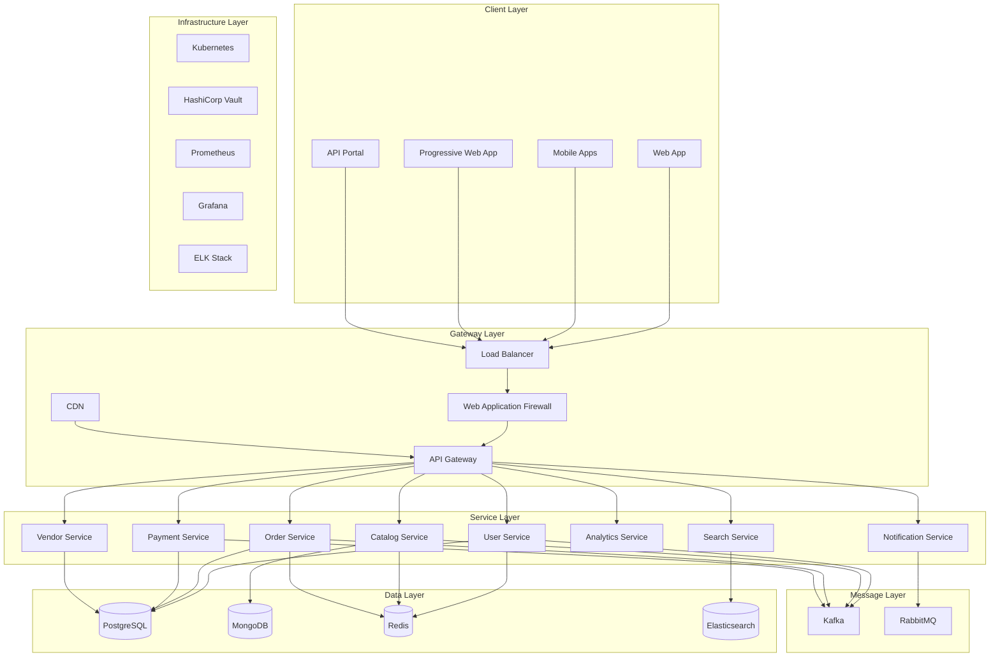
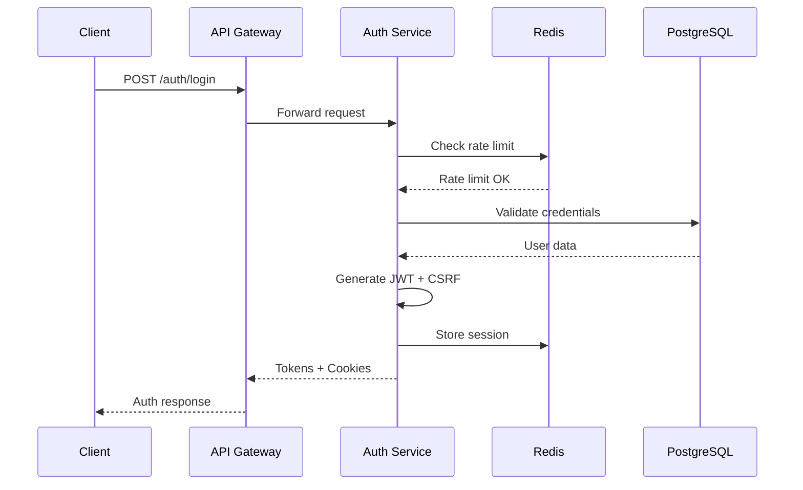

# SyriaMart Architecture Overview

**Last Updated**: January 15, 2025  
**Version**: 2.1.0  
**Status**: Foundation Phase - Authentication System Implemented  
**Compliance**: All architectural decisions require ADR documentation  
**Latest Update**: User Service authentication fully implemented with enterprise security

## Table of Contents

1. [System Architecture](#system-architecture)
2. [Microservices Design](#microservices-design)
3. [Data Architecture](#data-architecture)
4. [Security Architecture](#security-architecture)
5. [Integration Architecture](#integration-architecture)
6. [Deployment Architecture](#deployment-architecture)
7. [Architecture Decision Records](#architecture-decision-records)
8. [Syrian Market Adaptations](#syrian-market-adaptations)

## System Architecture

### High-Level Architecture



### Architecture Principles

1. **Microservices First**: Each service owns its data and is independently deployable
2. **API-First Design**: All services expose REST/GraphQL APIs with OpenAPI documentation
3. **Event-Driven**: Asynchronous communication via Kafka/RabbitMQ
4. **Cloud-Native**: Containerized services running on Kubernetes
5. **Security by Design**: Zero-trust security model with encryption at all layers
6. **Offline-First**: Progressive enhancement for unreliable connections
7. **Mobile-Optimized**: Performance optimization for mobile devices
8. **Documentation-First**: All decisions documented before implementation
9. **Contract-Driven**: Service interactions defined by contracts
10. **Resilience-First**: Built for Syrian infrastructure challenges

## Microservices Design

### Core Services

#### User Service ✅ IMPLEMENTED
- **Purpose**: User management, authentication, authorization
- **Database**: PostgreSQL (with read replicas)
- **Cache**: Redis (session store + rate limiting)
- **APIs**: REST (OpenAPI 3.x documented)
- **Events**: User.Created, User.Updated, User.Deleted, User.LoggedIn, User.LockedOut
- **Status**: Authentication System Complete (January 15, 2025)

**Implemented Features**:
- JWT authentication with configurable expiry
- CSRF protection middleware
- Rate limiting (5 login attempts/15 min)
- Strong password validation (12+ chars)
- Account locking after failed attempts
- Device fingerprinting
- Session management with Redis
- 100% contract test coverage

#### Catalog Service
- **Purpose**: Product management, categories, inventory
- **Database**: MongoDB
- **Search**: Elasticsearch
- **Cache**: Redis
- **APIs**: REST
- **Events**: Product.Created, Product.Updated, Inventory.Changed

#### Order Service
- **Purpose**: Order lifecycle management
- **Database**: PostgreSQL
- **State Machine**: Temporal
- **APIs**: REST
- **Events**: Order.Created, Order.Updated, Order.Completed

#### Payment Service ✅
- **Purpose**: Payment processing, wallet management, Syrian provider integration
- **Database**: PostgreSQL (encrypted, event sourced)
- **Security**: PCI-DSS compliant, tokenization required
- **APIs**: REST (OpenAPI 3.x documented)
- **Events**: Payment.Initiated, Payment.Completed, Payment.Failed, Payment.Refunded
- **Providers**: SEP, Syriatel Cash, MTN Pay, Cash on Delivery
- **Status**: API Specification Complete, Contract Tests Ready

### Service Communication Patterns

```yaml
patterns:
  synchronous:
    - API Gateway → Service: REST/GraphQL
    - Service → Service: REST with Circuit Breaker
    - Timeout: 30s default, 5s for critical paths
    
  asynchronous:
    - Event Streaming: Kafka
    - Message Queue: RabbitMQ
    - Event Sourcing: Selected aggregates
    
  resilience:
    - Circuit Breaker: Hystrix pattern
    - Retry: Exponential backoff
    - Bulkhead: Thread pool isolation
    - Timeout: Configurable per endpoint
```

## Data Architecture

### Database Strategy

```yaml
databases:
  postgresql:
    - user_service_db
    - order_service_db
    - payment_service_db
    - vendor_service_db
    
  mongodb:
    - catalog_service_db
    - analytics_service_db
    
  redis:
    - session_cache
    - api_cache
    - rate_limiting
    
  elasticsearch:
    - product_search
    - order_search
    - analytics_search
```

### Data Consistency Patterns

1. **Strong Consistency**: Within service boundaries (ACID)
2. **Eventual Consistency**: Across services via events
3. **CQRS**: Read/Write separation for high-traffic services
4. **Event Sourcing**: Payment and order services

### Data Privacy & Residency

```yaml
data_classification:
  personal_data:
    - location: Syrian datacenter
    - encryption: AES-256
    - retention: As per policy
    - access: Audit logged
    
  payment_data:
    - location: PCI-compliant datacenter
    - encryption: End-to-end
    - tokenization: Required
    - retention: 7 years
    
  business_data:
    - location: Primary + backup
    - encryption: At-rest
    - backup: Daily
    - retention: 3 years
```

## Security Architecture

### Security Layers

```yaml
perimeter_security:
  - WAF: OWASP rules
  - DDoS: CloudFlare protection
  - SSL/TLS: Mandatory HTTPS
  - Certificate: Let's Encrypt

application_security:
  - Authentication: OAuth2 + JWT
  - Authorization: RBAC + ABAC
  - API Security: Rate limiting, API keys
  - Input Validation: All endpoints

data_security:
  - Encryption: At-rest and in-transit
  - Key Management: HashiCorp Vault
  - Secrets: No hardcoding, rotation
  - PII: Tokenization/masking

infrastructure_security:
  - Network: Zero-trust model
  - Container: Security scanning
  - K8s: RBAC, Network policies
  - Monitoring: SIEM integration
```

### Compliance Requirements

- **OWASP Top 10**: Full compliance
- **PCI-DSS**: Level 1 for payment processing
- **Data Privacy**: GDPR-inspired policies
- **ISO 27001**: Security management

## Integration Architecture

### Payment Integrations

```yaml
payment_providers:
  sep:
    - protocol: REST API
    - auth: OAuth2
    - sandbox: Available
    - failover: Manual
    
  syriatel_cash:
    - protocol: SMS + API
    - auth: API Key
    - sandbox: Limited
    - failover: MTN Pay
    
  mtn_pay:
    - protocol: REST API
    - auth: Certificate
    - sandbox: Available
    - failover: Syriatel Cash
    
  crypto:
    - protocol: Web3
    - networks: ETH, BTC
    - wallet: MetaMask
    - smart_contracts: Audited
```

### Logistics Integrations

```yaml
shipping_providers:
  local_partners:
    - api: REST
    - tracking: Webhook
    - sla: 24-48 hours
    
  pickup_points:
    - integration: Direct
    - inventory: Real-time
    - notification: SMS
```

### Third-Party Services

```yaml
external_services:
  sms:
    - primary: Twilio
    - backup: Local provider
    - delivery: Guaranteed
    
  email:
    - provider: SendGrid
    - backup: Amazon SES
    - templates: Localized
    
  cdn:
    - provider: CloudFlare
    - regions: Middle East
    - caching: Aggressive
```

## Deployment Architecture

### Kubernetes Architecture

```yaml
cluster_setup:
  production:
    - nodes: 20 (auto-scaling)
    - regions: 2 (active-active)
    - ingress: Nginx
    - service_mesh: Istio
    
  staging:
    - nodes: 10
    - region: 1
    - mirrors: Production
    
  namespaces:
    - production
    - staging
    - monitoring
    - security
```

### CI/CD Pipeline

```yaml
pipeline_stages:
  1_build:
    - Compile TypeScript
    - Run linters
    - Build Docker images
    
  2_test:
    - Unit tests (>85%)
    - Integration tests
    - Contract tests
    - Security scan
    
  3_quality:
    - SonarQube analysis
    - Dependency check
    - License scan
    
  4_deploy_staging:
    - Deploy to staging
    - Run E2E tests
    - Performance tests
    
  5_deploy_production:
    - Manual approval
    - Blue-green deployment
    - Smoke tests
    - Rollback ready
```

### Monitoring Stack

```yaml
monitoring:
  metrics:
    - Prometheus: Service metrics
    - Grafana: Dashboards
    - AlertManager: Alert routing
    
  logging:
    - Elasticsearch: Log storage
    - Logstash: Log processing
    - Kibana: Log analysis
    
  tracing:
    - Jaeger: Distributed tracing
    - Correlation: Request ID
    
  apm:
    - NewRelic: Application monitoring
    - Custom: Business metrics
```

### Disaster Recovery

```yaml
dr_strategy:
  rto: 1 hour
  rpo: 15 minutes
  
  backup:
    - frequency: Continuous
    - retention: 30 days
    - testing: Monthly
    
  failover:
    - automatic: Database
    - manual: Application
    - runbook: Documented
```

## Performance Optimization

### Caching Strategy

```yaml
cache_layers:
  cdn:
    - static_assets: 1 year
    - api_responses: 5 minutes
    
  application:
    - session: Redis
    - api_cache: Redis
    - ttl: Context-aware
    
  database:
    - query_cache: Enabled
    - connection_pool: Optimized
```

### Mobile Optimization

```yaml
mobile_optimization:
  - Image compression: WebP format
  - Lazy loading: Below fold
  - Code splitting: Route-based
  - Service worker: Offline support
  - API pagination: 20 items default
  - Compression: Gzip/Brotli
```

## Scalability Design

### Horizontal Scaling

```yaml
scaling_strategy:
  services:
    - Auto-scaling: CPU/Memory based
    - Min replicas: 2
    - Max replicas: 20
    
  database:
    - Read replicas: 3
    - Sharding: User ID
    - Partitioning: Time-based
    
  cache:
    - Redis cluster: 6 nodes
    - Consistent hashing
```

### Load Distribution

```yaml
load_balancing:
  - Algorithm: Round robin
  - Health checks: Every 10s
  - Session affinity: Cookie-based
  - Geographic: CDN-based
```

## Architecture Decision Records

### Recent ADRs

1. **ADR-001**: Microservices Architecture
   - **Status**: Accepted
   - **Decision**: Use microservices for scalability and team autonomy
   - **Consequences**: Increased complexity, need for service mesh

2. **ADR-002**: Event-Driven Communication
   - **Status**: Accepted
   - **Decision**: Use Kafka for domain events, RabbitMQ for tasks
   - **Consequences**: Eventual consistency, event schema management

3. **ADR-003**: API-First Development
   - **Status**: Accepted
   - **Decision**: OpenAPI specs required before implementation
   - **Consequences**: Better documentation, contract testing

4. **ADR-004**: Syrian Payment Integration
   - **Status**: Accepted
   - **Decision**: Multi-provider strategy with failover
   - **Consequences**: Complex integration, higher reliability

### ADR Template

```markdown
# ADR-XXX: Title

## Status
Proposed | Accepted | Deprecated | Superseded

## Context
What is the issue we're addressing?

## Decision
What is our decision?

## Consequences
What are the positive and negative consequences?
```

## Syrian Market Adaptations

### Infrastructure Challenges

```yaml
connectivity:
  internet_penetration: 35.8%
  average_speed: 2 Mbps
  mobile_dominant: 60%+
  
adaptations:
  - Progressive Web App for offline
  - Aggressive caching strategies
  - Image optimization (WebP, lazy loading)
  - SMS fallback for critical features
  - Data compression (Brotli)
```

### Payment Landscape

```yaml
payment_methods:
  cash_on_delivery:
    - percentage: 75%
    - verification: SMS OTP
    - risk_management: Fraud scoring
    
  mobile_wallets:
    - syriatel_cash: 20%
    - mtn_pay: 15%
    - integration: API + SMS
    
  bank_cards:
    - percentage: <5%
    - providers: Local banks only
    - challenges: Sanctions, trust
```

### Localization Requirements

```yaml
language:
  - primary: Arabic (RTL)
  - secondary: English
  - dialects: Syrian Arabic
  
currency:
  - code: SYP
  - format: "#,### ل.س"
  - volatility: High
  
address_format:
  - governorate: Required
  - area: Required
  - landmarks: Common
  - postal_codes: Not used
```

### Performance Optimizations

```yaml
mobile_first:
  - Initial load: <3s on 3G
  - Interactive: <5s on 3G
  - Offline mode: Core features
  
optimizations:
  - Service Worker caching
  - Resource hints (preconnect, prefetch)
  - Critical CSS inlining
  - JavaScript code splitting
  - API response compression
  - CDN with Middle East PoPs
```

## Architecture Evolution

### Phase 1 (Current) - Foundation
- Core microservices setup
- Basic authentication and user management
- Payment provider integration
- API gateway configuration

### Phase 2 - Marketplace
- Vendor management system
- Product catalog with MongoDB
- Elasticsearch integration
- Order management workflow

### Phase 3 - Advanced Features
- AI-powered recommendations
- Multi-warehouse inventory
- B2B marketplace
- Advanced analytics

### Phase 4 - Scale & Optimize
- Performance optimizations
- Security hardening
- Cost optimization
- Regional expansion prep

### Phase 5 - Innovation
- Voice commerce (Arabic)
- AR product viewing
- Cryptocurrency payments
- API marketplace

## Monitoring & Observability

### Current Implementation Status

```yaml
implemented:
  - CI/CD pipeline with quality gates ✅
  - API documentation framework ✅
  - Security scanning automation ✅
  - User authentication system ✅
  - CSRF protection middleware ✅
  - Rate limiting service ✅
  - Session management (Redis) ✅
  
in_progress:
  - Kubernetes cluster setup 🚜
  - Service mesh configuration 🚜
  - Monitoring stack deployment 🚜
  - User profile management 🚜
  
planned:
  - Full observability platform 📦
  - Distributed tracing 📦
  - Business metrics dashboard 📦
  - Two-factor authentication 📦
```

## Key Architectural Decisions

### Technology Choices

| Component | Technology | Rationale |
|-----------|------------|------------|
| Backend | TypeScript/Node.js | Team expertise, ecosystem |
| API Framework | NestJS/Express | Enterprise features, flexibility |
| Databases | PostgreSQL, MongoDB | ACID + Document flexibility |
| Message Broker | Kafka, RabbitMQ | Streaming + Task queues |
| Container Orchestration | Kubernetes | Industry standard, flexibility |
| Service Mesh | Istio | Traffic management, security |
| API Gateway | Kong | Performance, extensibility |
| Monitoring | Prometheus/Grafana | Open source, powerful |

## Recent Updates

- **2025-01-15**: Implemented complete authentication system for User Service
- **2025-01-15**: Added CSRF protection and rate limiting infrastructure
- **2025-01-15**: Deployed Redis for session management and rate limiting
- **2025-01-15**: Updated architecture with implementation progress
- **2025-01-15**: Added Syrian market adaptation details
- **2025-01-15**: Documented payment provider architecture
- **2025-01-15**: Added ADR section for decision tracking

## Authentication Architecture Details

### Security Components

```yaml
authentication_stack:
  jwt:
    algorithm: RS256
    access_token_expiry: 15m (configurable)
    refresh_token_expiry: 7d (configurable)
    
  csrf_protection:
    pattern: double-submit-cookie
    token_rotation: per-request
    validation: automatic
    
  rate_limiting:
    backend: Redis
    login_limit: 5 attempts / 15 min
    register_limit: 5 attempts / hour
    account_lock: 10 failed attempts
    
  session_management:
    store: Redis
    cookie_security:
      - httpOnly: true
      - secure: true (production)
      - sameSite: strict
    expiry: 24 hours
```

### Authentication Flow

